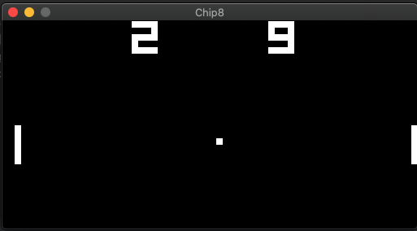

# Chip8 Emulator

A super basic implementation of CHIP8. Nothin' fancy here



## Usage

`make run`

## Input
16 keys, 0 to F (8, 4, 6, 2 are used for direction input)

###### Original gamepad
```
        1    2    3    C
        4    5    6    D
        7    8    9    E
        A    0    B    F
```

###### Keyboard mapping to the above ^
```
        1    2    3    4
        Q    W    E    R
        A    S    D    F
        Z    X    C    V
```


## TODO

- [ ] File-path flag
- [ ] RESET key
- [ ] Double buffering to prevent flickering
- [ ] Audio beep
- [ ] SUPER CHIP8 opcodes
- [ ] Hires mode
- [ ] Debug outputs

## References

- https://en.wikipedia.org/wiki/CHIP-8
- http://devernay.free.fr/hacks/chip8/C8TECH10.HTM
